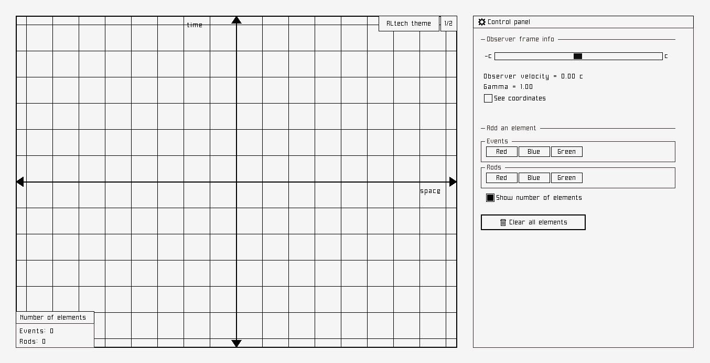
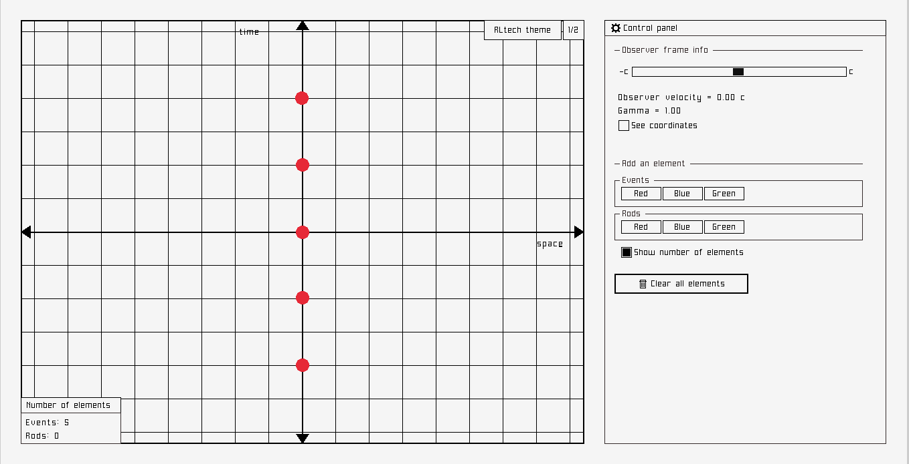
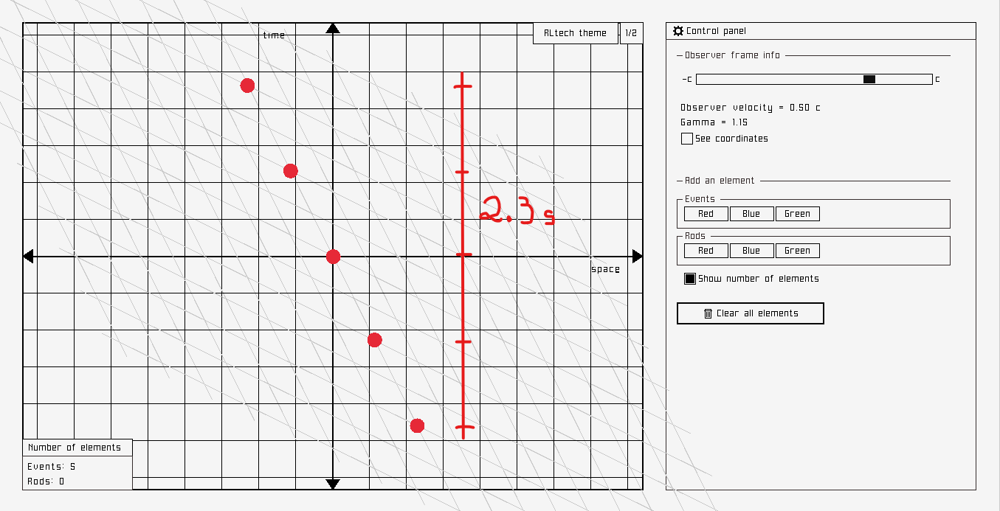
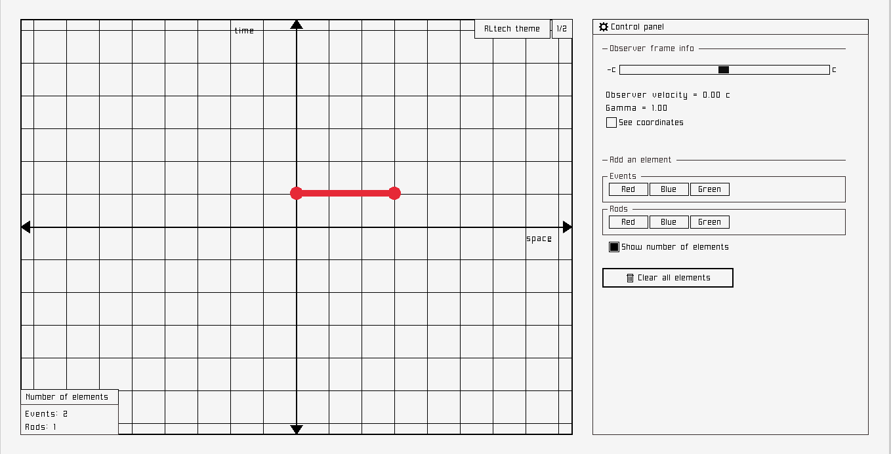
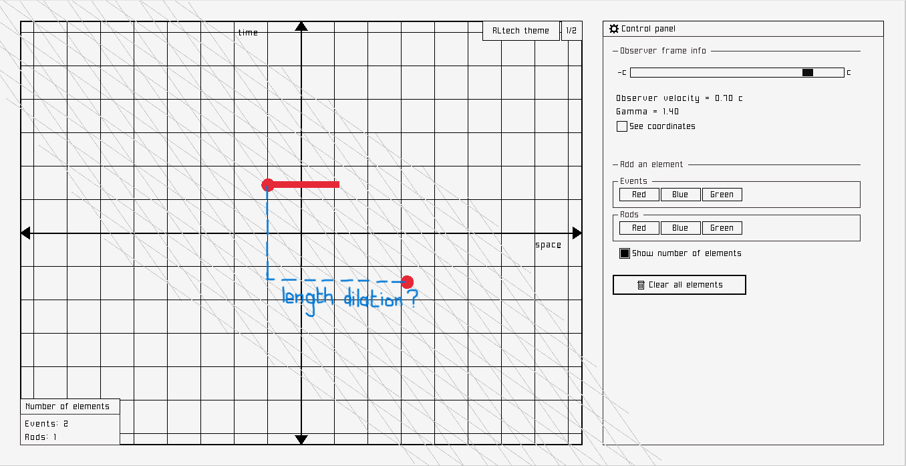
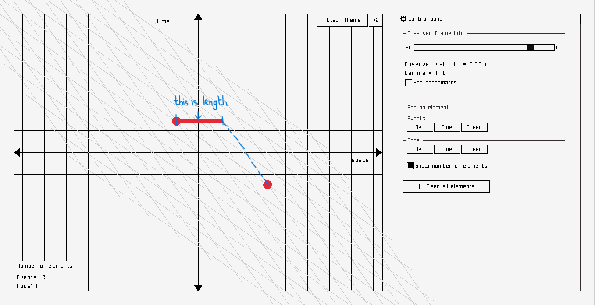

# Spacetime Globe Simulation

## Introduction to special relativity
Special relativity, developed by Albert Einstein, is a relatively (😉) popular theory in physics. It has significantly changed our understanding of the universe by establishing a relationship between space and time. It is based on two postulates:
- The laws of physics are invariant (identical) in all inertial frames of reference (that is, frames of reference with no acceleration). This is known as the **principle of relativity**.
- The speed of light in vacuum is the same for all observers, regardless of the motion of the light source or observer. This is known as the **principle of light constancy**.

In special relativity, observing things from different perspectives, especially moving perspectives, requires a mathematical tool called **Lorentz transformations**.

When students (including myself) are introduced to special relativity, it's generally with a bunch of abstract formulas, which don't really help you understand the underlying concepts.

This project comes with a solution to that problem. It is an interactive **Spacetime globe**, a visual tool to help build a strong intuition for how special relativity changes space and time perception. It is inspired by the spacetime globe shown in [minutephysics special relativity video series](https://www.youtube.com/playlist?list=PLoaVOjvkzQtyjhV55wZcdicAz5KexgKvm).

## Description

This project is an interactive spacetime diagram where you can observe how events and objects (rods) appear differently to observers moving at various relativistic velocities. It illustrates the core principles of special relativity, allowing users to:

- Visualize two frames of reference: the "Lab Frame" (your initial, stationary frame) and the "Observer Frame" (a frame moving at a velocity relative to the Lab Frame).
- Understand Lorentz transformations by seeing how coordinates of events change between these frames.
- Demonstrate relativistic effects like time dilation and length contraction through interactive elements.

This software is built using [`Raylib`]("https://www.raylib.com/"), a very easy library to make video games using C/C++.

## Installation process

Go to the **[Releases]("https://github.com/FreedGB/special-relativity-sim/releases")** section of the project, and download the zip file corresponding to your operating system (Windows or Linux).

Unzip the file, launch the executable file (`spacetime_globe.exe` for Windows and `spacetime_globe` for Linux) and you're ready to go!

## Features

The simulation displays a 2D spacetime diagram with a spatial axis (horizontal) and a temporal axis (vertical). One unit on the x-axis represents approximately $3\times 10^8$ meters (the distance light travels in one second) and one unit on the y-axis represents $1$ second.

Two frames are used in this simulation:

  - **Lab Frame (Secondary Grid):** This is the "rest" frame. This frame's grid lines appear to "shear" or deform when viewed from the Observer Frame, demonstrating how space and time mix under relativistic speeds.

  - **Observer Frame (Primary Grid):** This is *your* current frame of reference, which can be set to move at any velocity relative to the Lab Frame using the velocity slider. The grid lines of this frame always remain orthogonal and regular on the screen, as you are observing everything from this perspective.

The simulation applies the **Lorentz transformation** dynamically to all elements in the Lab Frame, showing their appearance in your chosen Observer Frame.

This tool allows you to:

- Visualize the two frames, making clear distinctions between the fixed-on-screen Observer frame and the transforming Lab frame.

- Change your observer's velocity ($v$) relative to the Lab Frame using a slider. As $v$ approaches the speed of light ($c$), you'll observe the relativistic effects.

> [!NOTE]
> $c$ (speed of light) is normalized to `1.0` in this simulation. So, the observer's speed $v$ is measured as a fraction of $c$

- Place individual "events" (spacetime points) in the Lab frame and see how their coordinates change in the Observer frame.

- Place "rods" (representing extended objects) in the Lab frame and witness their length contraction when viewed from a moving Observer frame.

- Change the theme by clicking on the top-right corner of the globe.

The interface is clear and user-friendly, so you're highly encouraged to poke around to understand how it works.

## Examples: two consequences of special relativity

In this section, we will use this simulation to visualize two popular effects of special relativity: **time dilation** and **length contraction**.

### 1 - Time Dilation

Add multiple events at the **same spatial coordinate** but at **different times**. The example below can represent a stationary clock that ticks every 2 seconds.

As you increase the `observer_velocity`, the vertical line (worldline) formed by these events in the Lab Frame will tilt. The time difference between these events will appear *longer* in the Observer frame: time dilation. For example, for an observer moving at half of the speed of light, the clock ticks every 2.3 seconds.

> [!WARNING]
> Note that the events don't happen at the same place anymore from that point of view, which is a crucial aspect of relativistic physics.

### Length Contraction

This one is a little bit more complicated. But we'll get into it.

First, add a rod (or multiple ones if you want to). Next, add two events: one at the tip of the rod, and the other at the tail (you will understand why soon).

Now, increase the `observer_velocity`. You will notice that the "distance" between the two events is now longer. But wait—shouldn't that be length dilation?

Well, what is **length**? In the context of special relativity, **length** can be defined as the spatial distance between two events happening at the same time. If something moves between the moment you measure its tip and the moment you measure its tail, you are no longer measuring its length!

That's exactly what is happening here. To get the rod's real length, the tip and the tail must be at the same time coordinate.

If we consider the version of the tail happening at the same time coordinate as the tip, we will notice the distance is actually *shorter*. And we can clearly see on the globe that the rod object is shorter along the x-axis when viewed in the Observer frame: length contraction.

To implement the rod, I had to use a special formula to place the tail of the rod correctly:

$$

x'_{tail} = -v \cdot t'_{tip} + \frac{x_{tail}}{\gamma}

$$

- $x'_{tail}$ is the space coordinate of the tail in the Observer frame
- $v$ is the Observer velocity relative to the Lab frame
- $t'_{tip}$ is the time coordinate of the tip in the Observer frame
- $x_{tail}$ is the space coordinate of the tail in the Lab frame
- $\gamma$ is gamma

I derived that formula manually to ensure accurate contraction of the rod's length. I'll update the README later to write it down.

## Final thoughts
This spacetime globe project was a challenging one! There were moments when I almost gave up, but I pushed through and finished it—because completing an imperfect project is better than endlessly chasing perfection. Even if it’s not exactly how I imagined it, I’m proud of what I accomplished. I learned so much about special relativity, C++ programming, and game development along the way.

I hope this tool will be useful to others.